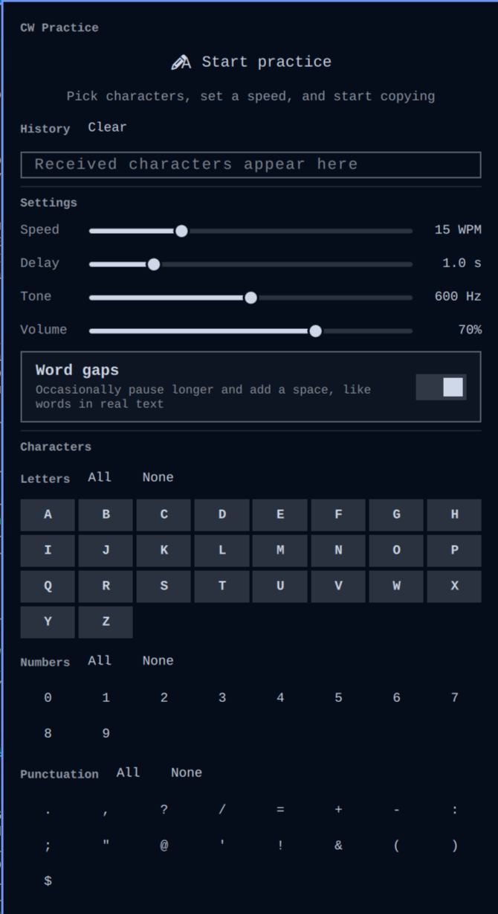

# CW Practice

An [Omarchy](https://omarchy.org/) shell plugin for amateur radio operators
practicing Morse code (CW) copy. Sends random characters as an audio sidetone
and reveals what was sent only after a selectable delay — so you copy by ear
first, then check yourself.



## Features

- **Start/Pause** — one button; the bar pill lights up while a run is active.
- **Character selection** — letters, numbers, and punctuation as toggleable
  grids (with All/None per group).
- **Speed** — 5–40 WPM, single-slider PARIS timing (dit = 1.2/WPM seconds).
- **Reveal delay** — 0–5 s in 0.5 s steps (snapped). Characters appear in
  the history only after the delay, so you're not relying on instantly
  seeing them.
- **History** — received characters wrap across the panel width; spaces mark
  word gaps. Clearable.
- **Word gaps** — toggleable: occasionally a 7-dit pause and a space, like
  words in real text.
- **Sidetone** — 400–800 Hz tone and volume sliders.
- **Live settings** — speed, tone, volume, word gaps, and character
  selection changes apply on the next character while a run is active
  (no restart, no gap in the audio). Reveal-delay changes apply to newly
  received characters; already-queued characters keep the delay they were
  received with.

## Installation

```
omarchy plugin add https://github.com/crueber/omarchy-cw-practice.git
```

Then enable it on the bar (if it is not placed automatically):

```
omarchy plugin enable crueber.cwpractice
```

The "CW" pill appears in the bar after the shell reloads.

## Removal

```
omarchy plugin remove crueber.cwpractice
```

Or delete `~/.config/omarchy/plugins/crueber.cwpractice/` and remove the
widget from your bar layout in `~/.config/omarchy/shell.json`, then restart
the shell (`omarchy restart shell`). Optionally also delete
`~/.local/state/omarchy/cwpractice/` (persisted settings).

## How it works

`Panel.qml` runs `cw_player.py` as a long-lived child process. The player
generates the sidetone with proper PARIS timing, streams raw PCM to `pacat`,
and prints each character to stdout as its audio finishes playing. The panel
queues each reported character and reveals it into the history after the
configured delay.

While a run is active, settings changes are sent to the player over stdin as
`SET key=value` lines (wpm, tone, volume, pool, word-gaps); the player applies
them at the next character boundary, so the audio never restarts. Delay
changes are panel-side and apply to newly received characters.

## State

Settings live at `~/.local/state/omarchy/cwpractice/state.json` (read with a
size-bounded, symlink- and FIFO-safe `dd` process; written atomically via
`mktemp` + `mv`).

## IPC

The plugin registers IPC functions. Opening the panel and reading the
history are always available; the state-changing functions are **disabled by
default** so no local process can start audio or change settings without a
panel interaction:

```
omarchy-shell crueber.cwpractice open     # open the panel
omarchy-shell crueber.cwpractice history  # print revealed characters
```

To opt in to scripting (e.g. from keybindings or another widget), add
`"allowIpcControl": true` to the widget entry in `~/.config/omarchy/shell.json`
(or run `omarchy bar set crueber.cwpractice allowIpcControl true`):

```
omarchy-shell crueber.cwpractice start    # start practice
omarchy-shell crueber.cwpractice stop     # pause practice
omarchy-shell crueber.cwpractice set wpm 25           # live-set a value
omarchy-shell crueber.cwpractice set pool ABC123     # live-set the pool
omarchy-shell crueber.cwpractice set delay 2000      # reveal delay (ms)
omarchy-shell crueber.cwpractice set tone 650        # also: volume, word-gaps
```

## Development

- QML files hot-reload on save; after editing `Model.js` or `cw_player.py`,
  run `omarchy restart shell`.
- `Model.js` is pure JS — its state parsing/clamping is testable with any JS
  runtime.
- `PATTERNS` in `Model.js` and `MORSE` in `cw_player.py` MUST stay in sync.
- Validate: `omarchy plugin validate ~/.config/omarchy/plugins/crueber.cwpractice`
- Check for load errors: `journalctl --user` (grep for the plugin id).

## Requirements

`python3`, `pacat` (PulseAudio tools) — both ship with Omarchy.
